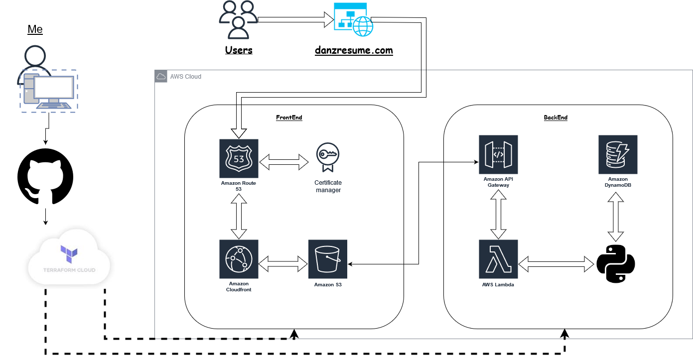

Cloud Resume Build
-------------------
  This is my resume cloud build which was built on AWS cloud platform. The pipeline starts off with github actions that runs workflows to Terraform Cloud. Terraform Cloud is in charge of running init, plan and apply of the FrontEnd and BackEnd workflows respectively. Those workflows will run when code changes are committed to either FrontEnd or Backend. 

FrontEnd
--
  The FrontEnd of the website consists of various services including S3, Cloudfront, AWS Certificate manager, Route53, HTML and CSS code which lives in the S3 bucket along with some JavaScipt for the API call. 
  - S3 (Simple Storage Service): S3 is a highly scalable object storage service provided by AWS.
  - Route 53: Route 53 is AWS's scalable domain name system (DNS) web service. It allows you to register domain names and manage DNS record which is where I purchased the domain for the site.
  - CloudFront: CloudFront is a content delivery network (CDN) service provided by AWS. It improves the performance and availability of the site by caching and serving content from edge locations around the world.
  - Amazon Certificate Manager (ACM): ACM is a service that allows provisioning, managing, and deploying SSL/TLS certificates for the site. It enables secure connections (HTTPS) and ability obtain an SSL/TLS certificate for my domain/site.

  In essence, visitors accessing the site will make a request to the domain name. Route 53 will route the requests to CloudFront, which will serve the content from the nearest edge location, improving the website's performance. CloudFront will also handle SSL/TLS encryption for secure connections.

Backend
---
  The BackEnd of the website consists of API Gateway, DynamoDB, and AWS Lambda.
  - API Gateway: API Gateway is a managed service in AWS that allows to create, publish, and manage APIs.
  - AWS Lambda: AWS Lambda is a serverless computing service that lets you run your code without provisioning or managing servers.
  - DynamoDB: DynamoDB is a NoSQL database service.

  The JavaScript code in the frontend makes API calls to API Gateway, which triggers the Lambda function. The Lambda function retrieves the counter value from DynamoDB and sends it back as a response, which updates the site with the latest value.

Terraform
---
  PlaceHolder Text

Future Updates
---
One of the first things I'd like to update on the site is rate limiting of the API call.
Also would like to see if I can add some testing to the Lambda function.
